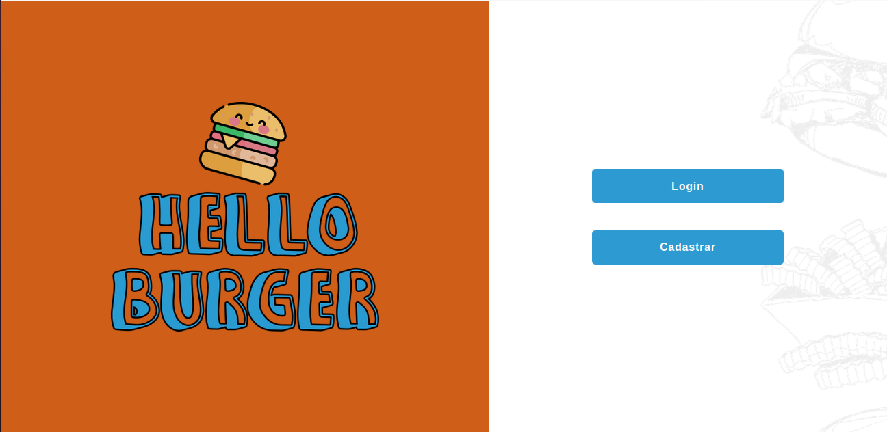

# Hello Burger

## Índice

- [1. Introdução](#1-introdução)
- [2. Construção da Idetidade Visual](#2-construção-da-identidade-visual)
- [3. Requisitos do Projeto](#3-requisitos-do-projeto)
- [4. Desenvolvedoras](#4-desenvolvedoras)
---
## 1. Introdução

O projeto Burger Queen foi uma proposta do bootcamp da Laboratória, onde o desafio proposto foi o desenvolvimento de um sistema Web, que fosse uma SPA e responsivo para tablet, onde fosse possível fazer a gestão dos pedidos de um restaurante.
As principais ferramentas utilizadas para o desenvolvimento desse projeto foram: HTML5, CSS3, JavaScript, React.JS, Material-UI, Postman e Trello.
## 2. Construção da Identidade Visual

Inicialmente, tivemos a orientação de criar um nome para a nossa aplicação, para torná-la única. Então, através de uma chuva de ideas que tivemos, chegamos ao nome Hello Burger.

**Por quê Hello Burger?**

Quando começamos os estudos sobre desenvolviemnto web, a primeira mensagem que printamos na tela é o famoso Hello World. Então, resolvemos unir este fato com o tema do projeto, que é era sobre um restaurante especializado em hamburgueres, nós simplesmente fizemos a junção de Hello World + Burger e eis que apresentamos aqui o Hello Burger.

**Escolha de cores**

Decidimos seguir as cores complementares e escolhemos os azul e laranja, que remetem a calma e energia.
## 3. Requisitos do Projeto
### Definição do produto

O produto que nos foi proposto seguiu as seguintes histórias:

#### [História de usuário 1] Usuário deve ter seu perfil (login/senha) para acessar o sistema.

Eu como funcionário do restaurante quero entrar na plataforma e ver apenas a tela importante para o meu trabalho.

##### Critérios de aceitação

O que deve acontecer para satisfazer as necessidades do usuário?

- Criar login e senha.
- Registar tipo de usuário (cozinha / salão), login e senha.
- Entrar na tela correta para cada usuário.

##### Definição de pronto

O acordado abaixo deve acontecer para dizer que a história está terminada:

- Você fez _testes_ de usabilidade e incorporou o feedback do usuário.
- Você deu deploy de seu aplicativo.

---

#### [História de usuário 2] Garçom/Garçonete deve poder anotar o seu pedido

Eu como garçom/garçonete quero poder anotar o meu pedido saber o valor de cada
produto e poder enviar o pedido para a cozinha para ser preparado.

##### Critérios de aceitação

O que deve acontecer para satisfazer as necessidades do usuário?

- Anotar o nome e mesa.
- Adicionar produtos aos pedidos.
- Excluir produtos.
- Ver resumo e o total da compra.
- Enviar o pedido para a cozinha (guardar em algum banco de dados).
- Funcionar bem e se adequar a um _tablet_.

##### Definição de pronto

O acordado abaixo deve acontecer para dizer que a história está terminada:

- Você fez _testes_ de usabilidade e incorporou o _feedback_ do usuário.
- Você deu deploy de seu aplicativo.

---

#### [História de usuário 3] Chefe de cozinha deve ver os pedidos

Eu como chefe de cozinha quero ver os pedidos dos clientes em ordem, poder marcar que estão prontos e poder notificar os garçons/garçonetes que o pedido está pronto para ser entregue ao cliente.

##### Critérios de aceitação

- Ver os pedidos à medida em que são feitos.
- Marcar os pedidos que foram preparados e estão prontos para serem servidos.
- Ver o tempo que levou para preparar o pedido desde que chegou, até ser marcado como concluído.

##### Definição de pronto

- Você fez _testes_ de usabilidade e incorporou o _feedback_ do usuário.
- Você deu deploy de seu aplicativo.

---

#### [História de usuário 4] Garçom/Garçonete deve ver os pedidos prontos para servir

Eu como garçom/garçonete quero ver os pedidos que estão prontos para entregá-los rapidamente aos clientes.

##### Critérios de aceitação

- Ver a lista de pedidos prontos para servir.
- Marque os pedidos que foram entregues.

## 4. Desenvolvedoras

Este projeto foi desenvolvido por:

[Juliane Cristina](https://github.com/Juliane-C)
[Sara Viana](https://github.com/SaraOhara)